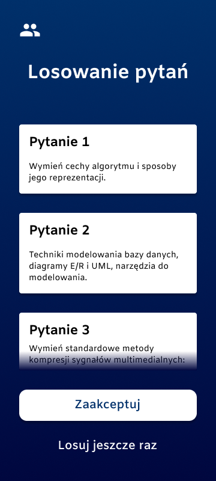
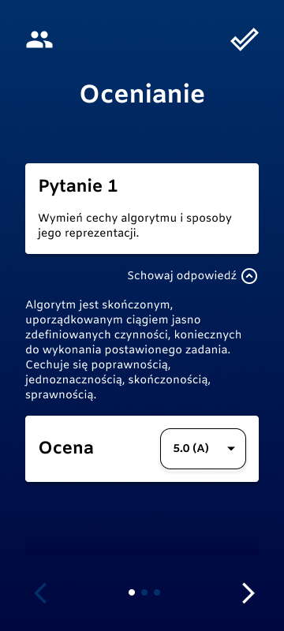
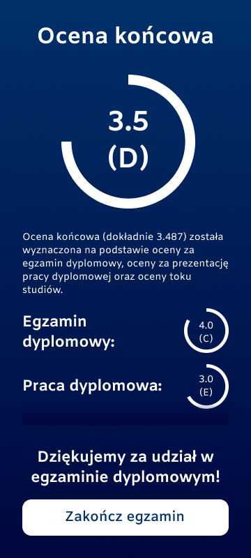

   

<h1 align="center"><b>Diploma Exam</b></h1>

*Diploma Exam* is an Android application for conducting university diploma examinations. It was the subject of my diploma thesis at the *Cracow University of Technology*.

## Screenshots

  
     
     
     
     

